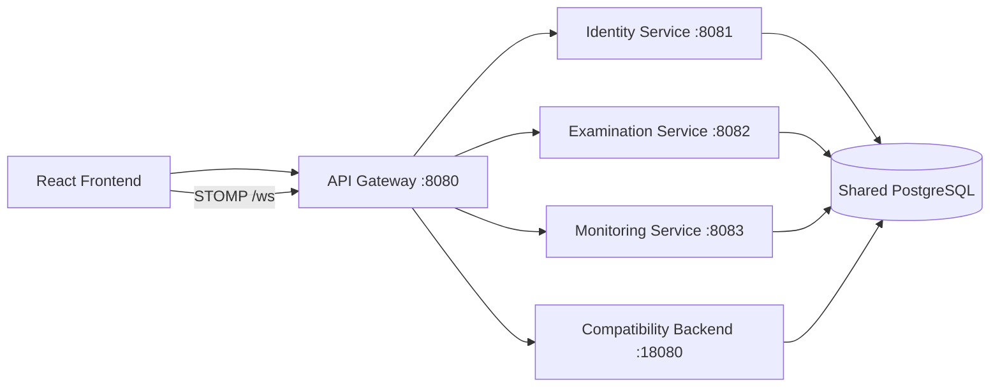
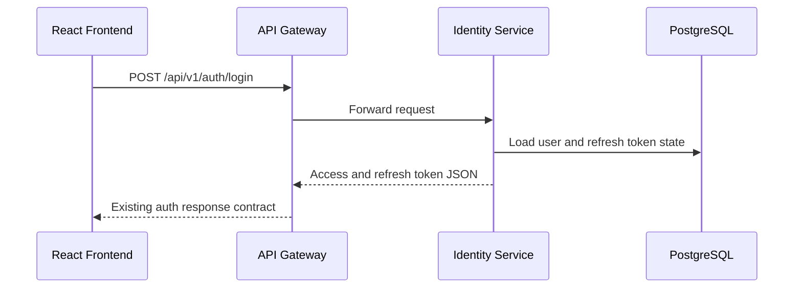
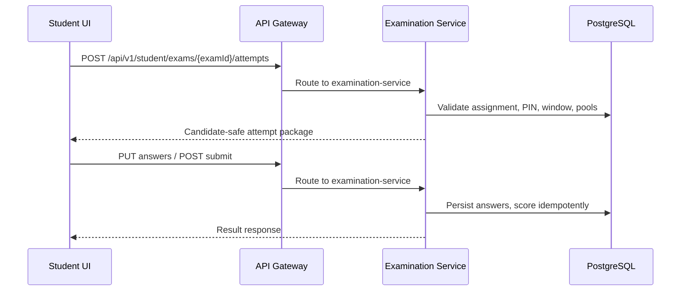
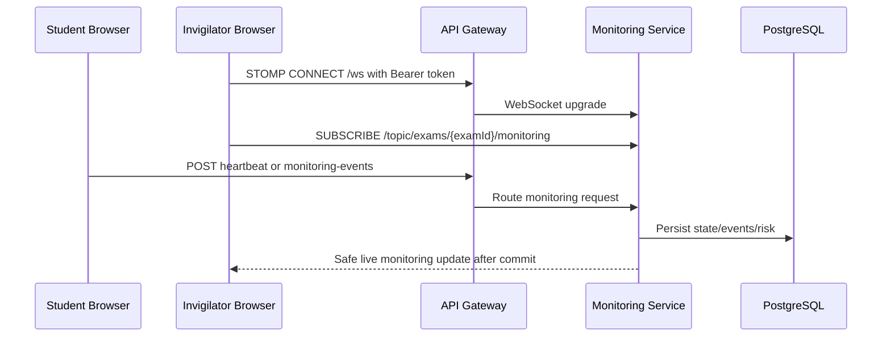

# CBT-Pulse Grid Microservices Architecture

CBT-Pulse Grid is now organized as an incremental microservices migration on the `feature/microservices` branch. The public API remains stable behind `api-gateway`, while identity, examination, and monitoring run as independently deployable Spring Boot services. The original backend remains as a compatibility fallback while the extracted services prove their runtime behavior.

## Service Responsibilities

| Service | Port | Owns |
| --- | ---: | --- |
| `api-gateway` | 8080 | Public routing, WebSocket upgrade proxying, security headers, request correlation forwarding |
| `identity-service` | 8081 | Authentication, JWT issuing and validation, refresh tokens, users, roles, institutions, profiles, passwords, avatar metadata, audit records |
| `examination-service` | 8082 | Subjects, question bank, exams, candidates, student exam lists, attempt start/resume, offline answer sync, scoring, results, CSV export, absence reports |
| `monitoring-service` | 8083 | Heartbeats, monitoring events, risk scoring, missed-heartbeat worker, STOMP live monitoring, webhook subscriptions and deliveries |
| `backend` | 18080 | Temporary compatibility fallback for any route not yet explicitly owned by an extracted service |
| `frontend` | 5173 | React role-based user experience |

## Gateway Route Ownership

| Public route | Gateway target | Owner |
| --- | --- | --- |
| `/api/v1/auth/**` | `identity-service:8081` | Identity |
| `/api/v1/users/**` | `identity-service:8081` | Identity |
| `/api/v1/institutions/**` | `identity-service:8081` | Identity |
| `/api/v1/audit/**` | `identity-service:8081` | Identity |
| `/api/v1/subjects/**` | `examination-service:8082` | Examination |
| `/api/v1/questions/**` | `examination-service:8082` | Examination |
| `/api/v1/exams/**` | `examination-service:8082` | Examination |
| `/api/v1/student/exams/**` | `examination-service:8082` | Examination |
| `/api/v1/student/attempts/{id}/answers` | `examination-service:8082` | Examination |
| `/api/v1/student/attempts/{id}/submit` | `examination-service:8082` | Examination |
| `/api/v1/student/attempts/{id}/result` | `examination-service:8082` | Examination |
| `/api/v1/student/attempts/**` | `examination-service:8082` | Examination |
| `/api/v1/results/**` | `examination-service:8082` | Examination |
| `/api/v1/student/attempts/{id}/heartbeat` | `monitoring-service:8083` | Monitoring |
| `/api/v1/student/attempts/{id}/monitoring-events` | `monitoring-service:8083` | Monitoring |
| `/api/v1/monitoring/**` | `monitoring-service:8083` | Monitoring |
| `/api/v1/webhooks/**` | `monitoring-service:8083` | Monitoring |
| `/ws` | `monitoring-service:8083` | Monitoring |
| `/v3/api-docs/**`, `/swagger-ui/**` | `backend:8080` | Compatibility documentation |
| `/api/**` | `backend:8080` | Compatibility fallback only |

Monitoring-specific attempt routes are matched before the generic `/api/v1/student/attempts/**` route so heartbeat and monitoring-event traffic cannot be swallowed by the examination service.

## JWT Trust Model

The identity service issues HS256 JWT access tokens. Extracted services validate the same issuer, expiry and shared secret for this migration phase. Tokens preserve the existing claims: `sub`, `email`, `institutionId`, `roles`, `iss`, `iat`, `exp`, and `jti`.

Gateway routing is not the only security boundary. Each service keeps its own Spring Security configuration, role checks, tenant checks, and safe error handling. A manually entered URL must still be denied by the target service when the authenticated role or tenant is not allowed.

## Shared Database Decision

All services currently use the same PostgreSQL instance and existing Flyway history. This is intentional to avoid destructive data movement while proving service extraction, gateway routing, Docker packaging, CI, Kubernetes manifests, and runtime authorization. Logical ownership is enforced by service boundaries, code ownership, and route ownership.

The future database-per-service phase should remove cross-service foreign keys, introduce service-owned schemas or databases, and replace direct table reads between services with internal APIs or events.

## Request Flows

### Login

### Start and Submit Exam

### Monitoring and STOMP

## Why Four Services

The split keeps the defense understandable: gateway, identity, examination, and monitoring map to clear responsibilities and real runtime concerns. Creating many tiny services now would add operational complexity without improving the final-year project argument. Results and attempts stay with examination because they rely on exam, candidate, question snapshot, and scoring data. Webhooks stay with monitoring because they are driven by monitoring events.

## Remaining Compatibility Fallback

The fallback exists to reduce migration risk while the branch is hardened. Current explicitly documented fallback routes are Swagger/OpenAPI routes and the broad `/api/**` safety net. Any future endpoint that still depends on the compatibility backend must be recorded before release; otherwise it should be routed to one of the extracted services.
